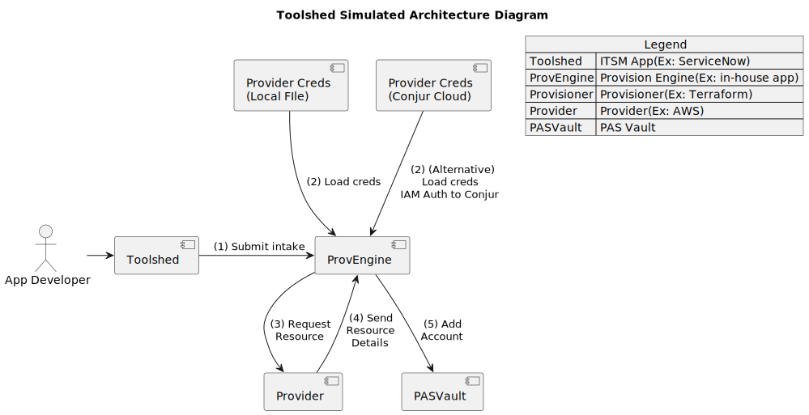

# IT Toolshed

<!--
Author:   David Hisel <david.hisel@cyberark.com>
Updated:  <2023-10-02 16:31:19 david.hisel>
-->

**NOTE: "IT Toolshed" is intended as a front-end for DEMO purposes only.**

## How will this Accelerator Help?

This repo contains example code as a guide to help with the following scenarios.

* Automating the storage of credentials after a provisioning event.  E.g. automating saving of EC2 credentials into PAS Vault after the EC2 instance has been provisioned.
* How to setup Conjur to connect without hard coding credentials in a config file.  E.g. Using the Conjur AWS authenticator to fetch credentials from Conjur without storing Conjur user's credentials, rather, this setup will use an AWS Role that Conjur is configured to recognize when a client is authenticating.

## Prerequisites

To use this solution accelerator, you will need:

* An AWS account
  * AWS User -- used for provisioning an EC2 instance
  * AWS Role -- used for Conjur AWS Authenticator
* CyberArk PAS Vault created and ready to go
  * Safe to store provisioner credentials
  * Safe to store the newly created credentials
* CyberArk Conjur Cloud account
  * PAS Vault sync enabled
  * AWS Authenticator configured and enabled
* Access to a Demo Host -- Optimal demo experience, run this from an EC2 instance
* GO lang compiler, v1.21
* GNU Make, v3.81

### -Required- AWS Account And Demo Host Setup

1. AWS User with permissions to Create Tags, Create Key Pairs, and Create EC2 instances.
   1. Create AWS Key and Secret credentials to be used for the "Provisioning" of resources.  E.g. these creds will be used to provision a new keypair and new ec2 instance.
   2. Store these credentials in your PAS Vault, and ensure they are synchronized to Conjur.
2. ARN for the AWS Role to assign to your EC2 demo host.
   * Bind this role to the EC2 instance where you run this demo code from.
   * **OR**
   * IF running from NON EC2 host, like a linux or mac machine, then setup the AWS CLI to run as a user that can ***AssumeRole*** to the role created above.

### -Required- CyberArk PAS Vault

1. Create a safe for storing the Provider credentials.  The AWS Key and Secret created above in step 1 should be stored here.  These creds will be synchronized to Conjur and read from Conjur.
2. **Safe Name** -- Create a safe for storing the new resource's account information.  This safe will be where the new EC2 instance creds will be stored.  Only the safe needs to be created, and **the credentials to access the safe will be entered in the toolshed UI**.  This simulates the developer requesting the resource to be created, and then the developer enters their safe's credentials.

### -Required- Conjur Cloud Setup

1. Create an AWS User with permissions associated to Conjur for "authn-iam" connector
   * Create Access Key and Secret for this user
   * Store these credentials in your PAS Vault safe
2. Install Conjur IAM Authenticator
   * See the `./etc` directory for example setup.
   * See the `load-policies.sh` script for an example of how to load the policies.
   * Conjur CLI install instructions can be found on the [CyberArk Conjur CLI page](https://docs.cyberark.com/conjur-enterprise/13.0/en/Content/Developer/CLI/cli-setup.htm).
   * (Optional) `./etc/iam-check.py` script can help with
     troubleshooting the Conjur AWS Authenticator configuration.

3. Enable PAS Vault sync

## Demo Setup and Usage

**IMPORTANT** - Please read and configure the resources as specified in the [Prerequisites](#prerequisites) section before proceding with the demo.

It is recommended to run this demo from an EC2 instance.  This demo can be run from linux/mac machine with extra setup.

### Steps to run through the demo

* [Scenario - Hard Coding Credentials](README-scenario1.md)
* [Scenario - Conjur AWS Authenticator](README-scenario2.md)

### Configuration Files

This section will describe the contents of the fields for each of the configuration files.

#### PAS Config File

Copy the example config file, `./cmd/provengine/pasconfig-example.toml` with name `./cmd/provengine/pasconfig.toml`

Here is what the example looks like.

```ini
[pasvault]

# Cloud Identity Portal (ID Tenant where the user is managed)
idtenanturl = "https://IDENTITY_TENANT_ID.id.cyberark.cloud"

# Safe owner/user must enter PAS Vault user/pass in Toolshed UI

# Privilege Cloud (Where the Vault-safe is located)
pcloudurl = "https://example-demo-toolshed.privilegecloud.cyberark.cloud"
safename = "toolshed-safe1"
```

| Field Name | Description | Required For Scenario 1 | Required For Scenario 2 |
| -- | -- | -- | -- |
| idtenanturl | Cloud Identity Portal (ID Tenant where the user is managed) | YES | YES |
| pcloudurl | This is the base url to your PAS instance; no trailing slash | YES | YES |
| safename | This is the name of the PAS Vault safe that you created as part of the pre-requisites.  NOTE: This is where the NEW EC2 creds will be stored. | YES | YES |

#### AWS Config File

Copy the example config file, `./cmd/provengine/awsconfig-example.toml` with name `./cmd/provengine/awsconfig.toml`

**NOTE: For "Scenario 1"** -- Fill out all of these fields, and leave Conjur config file `empty`.

**NOTE: For "Scenario 2"** -- ONLY fill out the `region` field, and completely fill out the conjur config.

Here is what the example looks like.

```toml
[awsprovider]

# REQUIRED
# Set this to your Target Region where you will provision your EC2 instance
region = "us-west-2"

# FOR Demo "Scenario 1 - Hard Code Credentials"
# -- Fill-in the AWS Key/Secret fields here
#
# FOR Demo "Scenario 2 - Conjur AWS Authenticator"
# -- Leave these fields empty strings 
#    (in other words, leave these empty if using Conjur to fetch
#    the AWS Provider creds)

# For more details, see README.md: "-Required- AWS Account And Demo Host Setup"
accesskey = ""
accesssecret = ""
```

| Field Name | Description | Required For Scenario 1 | Required For Scenario 2 |
| -- | -- | -- | -- |
| region | AWS Region where the NEW EC2 instance will be provisioned | YES | YES |
| accesskey | AWS User's access key | YES | NO (Keep empty) |
| accesssecret | AWS User's access secret | YES | NO (Keep empty) |

#### Conjur Config File

Copy the example config file, `./cmd/provengine/conjurconfig-example.toml` with name `./cmd/provengine/conjurconfig.toml`

**NOTE: For "Scenario 1"** -- Leave Conjur config file `empty`.

**NOTE: For "Scenario 2"** -- Completely fill out the Conjur config file.

Here is what the example looks like.

```ini
[conjur]
apiurl              = "https://conjurserver.example.com/api"
account             = "conjur"

# Conjur Cloud -- Resources -> Workloads (or Host) ID
# Find the workload (or host) ID for your resource.
# Prepend the string literal "host/" to form the identity.
#
# Example: For host/workload ID "data/toolshed/12345678/toolshed"
#          The identity value will be "host/data/toolshed/12345678/toolshed"
identity            = ""

# Identifier for the Conjur AWS authenticator that is setup for this demo
authenticator       = "authn-iam/APPNAME"

# Conjur Region -- used for authn-iam (Region where Conjur is running)
awsregion           = "us-east-1"

# AWS key/secret used to authenticate to Conjur for authn-iam 
#
# If running this demo from an EC2 instance, the role assigned 
# to the EC2 instance will be used.
#  OR
# If running from linux/mac, then the credentials from your 
# AWS User should be placed here.  This user will need permissions
# to assume the role in the `assumerolearn` setting.
awsaccesskey        = ""
awsaccesssecret     = ""

# REQUIRED: Assume role arn is the role that was used when setting up 
#           the Conjur AWS authenticator
awsassumerolearn    = "arn:aws:iam::12345678:role/toolshed"

# Conjur path to AWS key/secret used to provision resources
awsprovideraccesskeypath    = "data/vault/PATH/TO/THE/AWSProviderAccessKey"
awsprovideraccesssecretpath = "data/vault/PATH/TO/THE/AWSProviderAccessSecret"
```

| Field Name | Description | Required For Scenario 1 | Required For Scenario 2 |
| -- | -- | -- | -- |
| apiurl                      | Conjur API endpoint | NO | YES |
| account  | Conjur Account | NO | YES |
| identity  | Conjur Identity associated to the user [(footnote 1)](README.md#conjur-cloud-authenticator-identity) | NO | YES |
| authenticator  | Conjur Authenticator, prefix with "authn-iam/" and append the Authenticator "Service ID" [(footnote 2)](README.md#conjur-authenticator-service-id)  | NO | YES |
| awsregion  | Conjur AWS Region -- which AWS region is running Conjur (this can be different from the provider AWS region) | NO | YES |
| awsaccesskey  | AWS User's access key -- used to assumerole | NO | Only when running from a non EC2 host |
| awsaccesssecret | AWS User's access secret -- used to assumerole | NO | Only when running from a non EC2 host |
| awsprovideraccesskeypath  | Conjur Resources, Secrets "ID" where the Provider AWS Access Key is stored (see [footnote 3](README.md#conjur-aws-provider-access-key-and-secret-path)) | NO | YES |
| awsprovideraccesssecretpath | Conjur Resources, Secrets "ID" where the Provider AWS Access Secret is stored (see [footnote 3](README.md#conjur-aws-provider-access-key-and-secret-path)) | NO | YES |

## Workflow Diagrams

### Scenario 1 -- Provider Credentials in a File

Provider credentials have permissions to create, modify and delete resources at the provider.  For this demo, AWS is the provider.  This scenario is used to contrast with Scenario 2 so that one can see the differences between the two.

<!--

-->


### Scenario 2 -- Provider Credentials from Conjur

This scenario demonstrates the separation of concerns by using 2 sets of AWS credentials, one set of credentials is used to authenticate to Conjur Cloud, and the other set of credentials is used to provision resources in AWS.

<!--

-->


There are 2 apps that comprise this demo, the "ITSM App" and the "Provision Engine."   The "ITSM App" provides an intake form for an application developer to make a request for a resource.  The "Provision Engine" will accept the request, call the Provider to request resources to be created, and then store the new resource information in the PAS Vault safe.

Under `cmd/toolshed` is the app that provides a web server app to provide the intake form and forward the request to the provision engine.

Under `cmd/provengine` is the app that will either use the Provider creds from a file (Scenario 1), or, it will call on Conjur Cloud and fetch the provider credentials from there.

The following reference diagram illustrates a high-level process flow whereby a resource is requested, provisioned, and access details are returned to the requestor.  

This diagram illustrates how the toolshed app and the provengine app work together.

### Toolshed Simulated Architecture Diagram
<!--

-->


## License

        Copyright (c) 2023 CyberArk Software Ltd. All rights reserved.
        
        Licensed under the Apache License, Version 2.0 (the "License");
        you may not use this file except in compliance with the License.
        You may obtain a copy of the License at
        
           http://www.apache.org/licenses/LICENSE-2.0
        
        Unless required by applicable law or agreed to in writing, software
        distributed under the License is distributed on an "AS IS" BASIS,
        WITHOUT WARRANTIES OR CONDITIONS OF ANY KIND, either express or implied.
        See the License for the specific language governing permissions and
        limitations under the License.
        
For the full license text see [`LICENSE`](LICENSE).

## Contributing

We welcome contributions of all kinds to this repository. For instructions on how to get started and descriptions of our development workflows, please see our [contributing
guide](https://github.com/cyberark/conjur/blob/master/CONTRIBUTING.md).


## References

* [PAS Vault Add Account](https://docs.cyberark.com/PAS/Latest/en/Content/WebServices/Add%20Account%20v10.htm)
* [PAS Vault REST API doc](https://docs.cyberark.com/Product-Doc/OnlineHelp/PAS/Latest/en/Content/WebServices/Implementing%20Privileged%20Account%20Security%20Web%20Services%20.htm?tocpath=Developer%7CREST%20APIs%7C_____0)

## Footnotes

### Conjur Cloud Authenticator Identity

> 

### Conjur Authenticator "Service ID"

> 

### Conjur AWS Provider Access Key and Secret Path

> 
